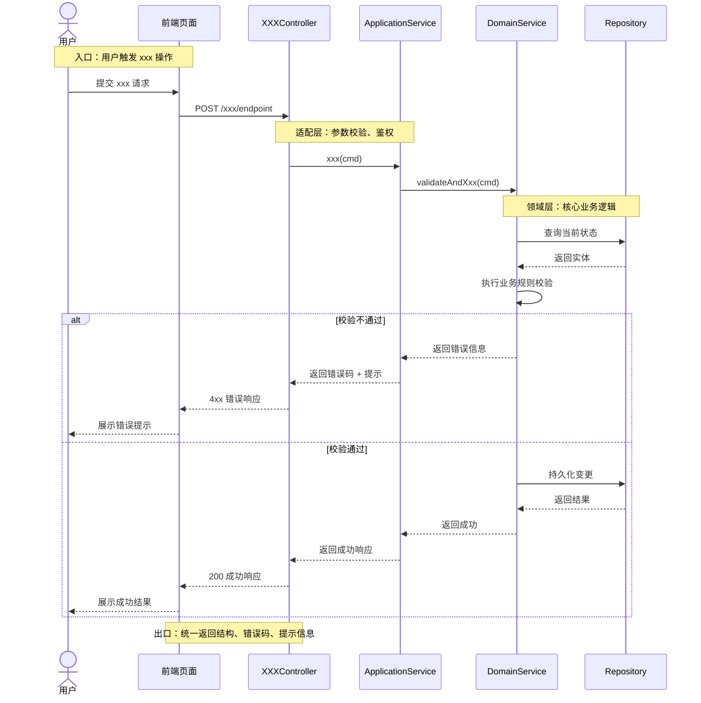

# 08-总结文档 模板

```markdown
# 总结文档

**项目名称**：XXX项目

## 变更日志

| 版本 | 日期 | 作者 | 变更内容 |
|------|------|------|----------|
| <动态生成> | YYYY-MM-DD | <作者> | 初始版本 |

---

## 一、需求描述

### 1.1 需求背景
[需求来源与业务背景：为什么要做这个需求，解决什么问题]

### 1.2 核心功能
[需求实现了哪些功能，按功能模块逐一列出]

- 功能A：[一句话描述]
- 功能B：[一句话描述]

### 1.3 功能范围与边界
[明确包含哪些功能，不包含哪些功能；如有外部依赖也在此说明]

---

## 二、目录结构

[关键文件路径与模块职责映射，仅列出与本次需求相关的核心文件]

| 路径 | 模块 | 职责 |
|------|------|------|
| `src/xxx/Controller.java` | 控制器层 | 接收请求、参数校验、返回响应 |
| `src/xxx/Service.java` | 应用服务层 | 编排业务流程、事务管理 |
| `src/xxx/DomainService.java` | 领域服务层 | 核心业务规则 |
| `src/xxx/Repository.java` | 仓储层 | 数据持久化 |

---

## 三、核心业务流程

### 3.1 主流程时序图（必填）



### 3.2 关键注释说明（必填）

对时序图中标注的 `Note` 逐一展开说明：

1. **入口**：什么场景、谁触发、前置条件是什么
2. **前置校验**：权限、参数、数据状态、幂等/并发规则
3. **核心业务规则**：关键判断条件、状态流转、计算公式
4. **分支逻辑**：各分支触发条件与处理差异
5. **出口**：返回结构与错误码约定

### 3.3 其他关键流程（如有）

[若存在多个独立业务流程，补充额外的时序图，格式同 3.1]

---

## 四、数据模型

> 若本次需求不涉及数据模型变更，标注"本次需求无新增或变更数据模型"，删除以下内容。

### 4.1 核心实体

| 实体/表名 | 用途 | 本次变更 |
|-----------|------|----------|
| `xxx_table` | 用途描述 | 新增/修改字段 xxx |

### 4.2 关键字段说明

| 实体 | 字段 | 类型 | 说明 |
|------|------|------|------|
| `xxx_table` | `field_a` | varchar(64) | 字段说明 |

---

## 五、API 接口清单

> 若本次需求不涉及 API 变更，标注"本次需求无新增或变更 API"，删除以下内容。

| 方法 | 路径 | 功能 | 鉴权 |
|------|------|------|------|
| POST | `/api/xxx/create` | 创建 xxx | Bearer Token |
| GET | `/api/xxx/{id}` | 查询 xxx 详情 | Bearer Token |
| PUT | `/api/xxx/{id}` | 修改 xxx | Bearer Token |

---

## 六、构建与运行

### 6.1 环境要求
- 语言版本：[如 Java 17、Node 20、Python 3.11]
- 数据库：[如 MySQL 8.0]
- 中间件：[如 Redis 7、Kafka 3]

### 6.2 关键配置项

| 配置项 | 说明 | 默认值 |
|--------|------|--------|
| `xxx.enabled` | 功能开关 | true |
| `xxx.timeout` | 超时时间(ms) | 3000 |

### 6.3 启动命令

```bash
# 安装依赖
xxx install

# 启动服务
xxx run

# 运行测试
xxx test
```

---

## 七、实现指引

[按模块分拆为可执行的任务清单，每个任务包含：目标、涉及文件、关键注意点。Agent 可按序号顺序执行。]

### 7.1 任务清单

| 序号 | 任务 | 模块 | 涉及文件 | 说明 |
|------|------|------|----------|------|
| 1 | xxx | xxx | `path/to/file` | 关键注意点 |
| 2 | xxx | xxx | `path/to/file` | 关键注意点 |

### 7.2 实现顺序
[任务间如有依赖关系，在此说明推荐实现顺序及原因]

---

## 八、注意事项

### 8.1 已知约束
- [约束1：如不能修改公共接口签名]
- [约束2：如必须兼容旧版本数据]

### 8.2 待确认项
- [待确认1：xxx -- 需产品/架构确认]
- [待确认2：xxx -- 需上下游对齐]

### 8.3 风险点
- [风险1：xxx，缓解措施：xxx]
- [风险2：xxx，缓解措施：xxx]
```
