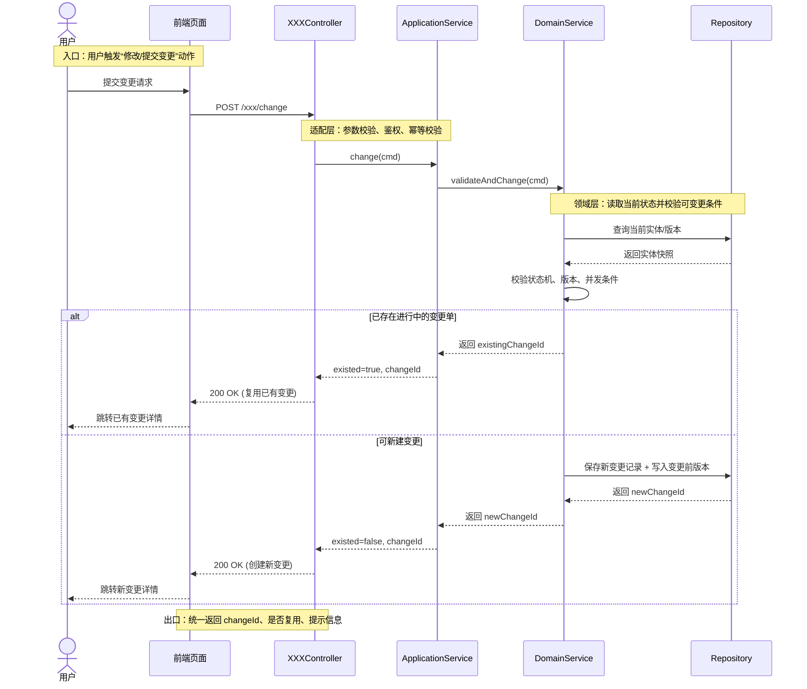
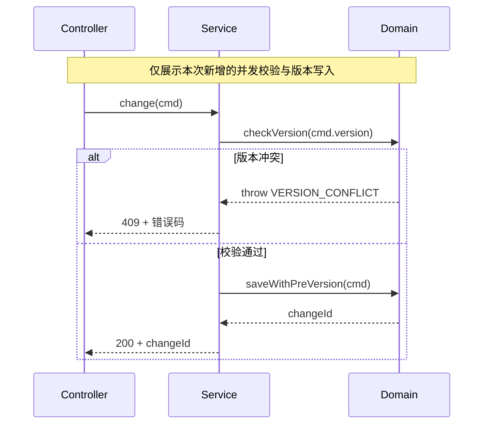

# 02-概要设计 模板

```markdown
# 概要设计

**项目名称**：XXX项目
**作者**：<作者>
**日期**：YYYY-MM-DD
**版本**：V1.0

## 变更日志

| 版本 | 日期 | 作者 | 变更内容 |
|------|------|------|----------|
| V1.0 | YYYY-MM-DD | <作者> | 初始版本 |

---

## 一、系统架构

### 1.1 设计模式
[采用的设计模式说明]

### 1.2 架构图
[架构图描述或文本表示]

## 二、模块划分

| 模块名 | 命名空间 | 职责 |
|--------|----------|------|
| 模块A | XXX | 职责描述 |

## 三、类图关系
[类继承和关联关系描述]

## 四、核心流程概要
[主要业务流程概述]

### 4.1 变更流程时序图（必填）
[要求：必须包含“变更前置校验 -> 变更执行 -> 分支处理 -> 返回结果”；可按实际模块替换参与者名称]



### 4.2 时序点说明（建议逐条填写）
1. 触发条件：谁在什么场景下发起变更。
2. 前置校验：权限、参数、数据状态、并发/幂等规则。
3. 关键写操作：哪些表/聚合被修改，是否记录变更前版本。
4. 分支策略：已存在草稿/进行中单据时如何处理。
5. 返回契约：成功/复用/失败返回结构与错误码。

### 4.3 长流程处理（流程过长时必填其一）
当完整流程较长时，不要求把所有细节都画在一张图里，优先展示“本次改动影响的时序点”：
1. 主时序图：仅保留端到端主链路（5-9个关键交互）。
2. 改动时序图：单独新增“变更点子流程图”，只画新增或修改的调用链。
3. 注释标记：在图中用 `Note over` 明确“新增/调整/兼容旧逻辑”位置。
4. 差异说明：在图下补充“改动前 -> 改动后”两到三条对照说明。

#### 4.3.1 改动点子流程示例（可选）


## 五、依赖关系

| 依赖项 | 版本 | 用途 |
|--------|------|------|
| 依赖A | X.X | 用途描述 |
```
